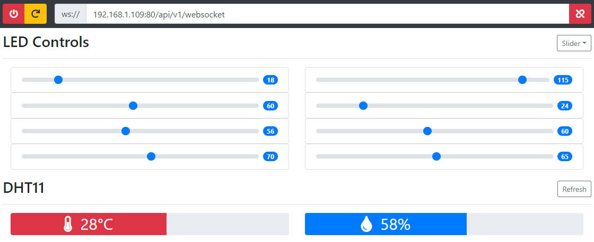

# ESP8266 Remote Boot UI
Client software that communicates with the websocket server on the ESP8266 remote boot.
Can be used to remotely turn a computer on and off, perform resets.
Also features 8 programmable LED channels for PC lighting, as well as a live readout for
temperature and humidity data.

Server for ESP8266 can be [found here](https://github.com/FiendChain/ESP8266-RemoteAccess).

## Gallery
### Client disconnected

### Client connected and PC off

### Client connected and controlling leds
